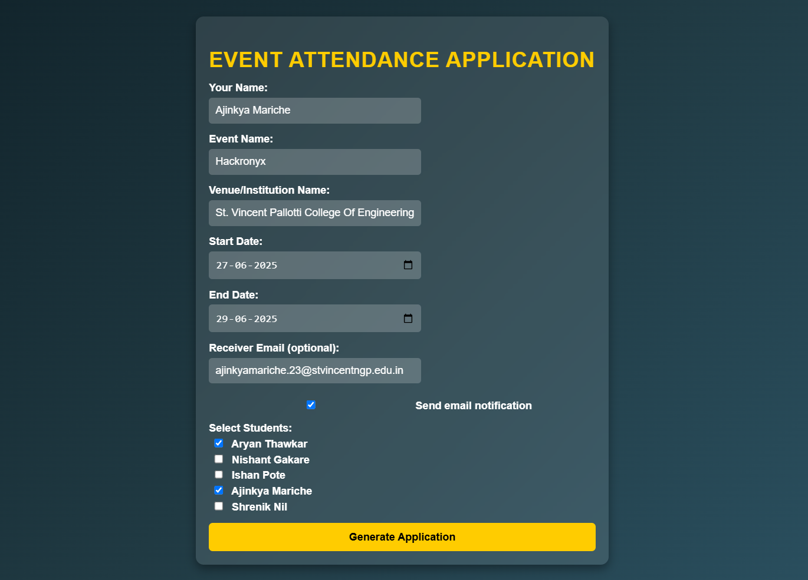
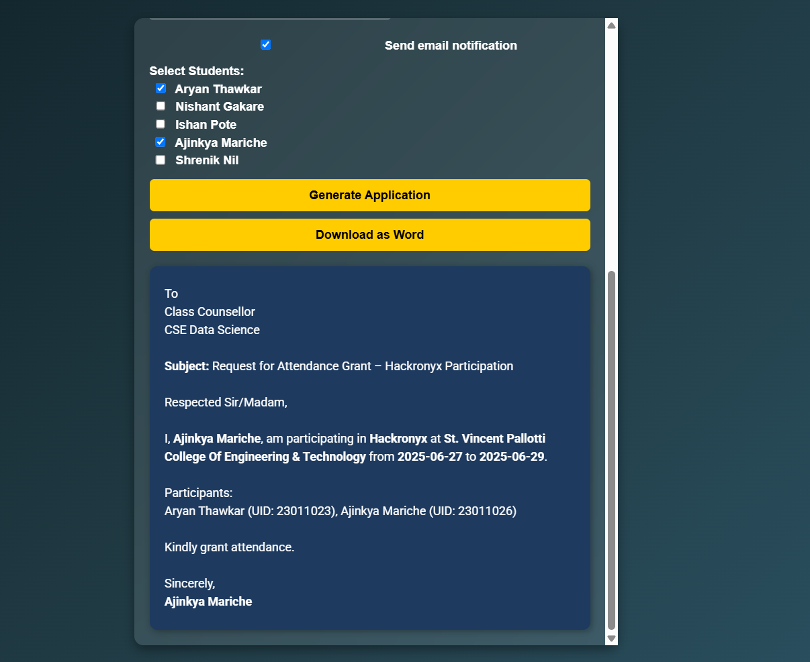
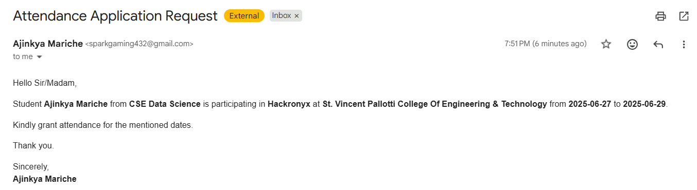
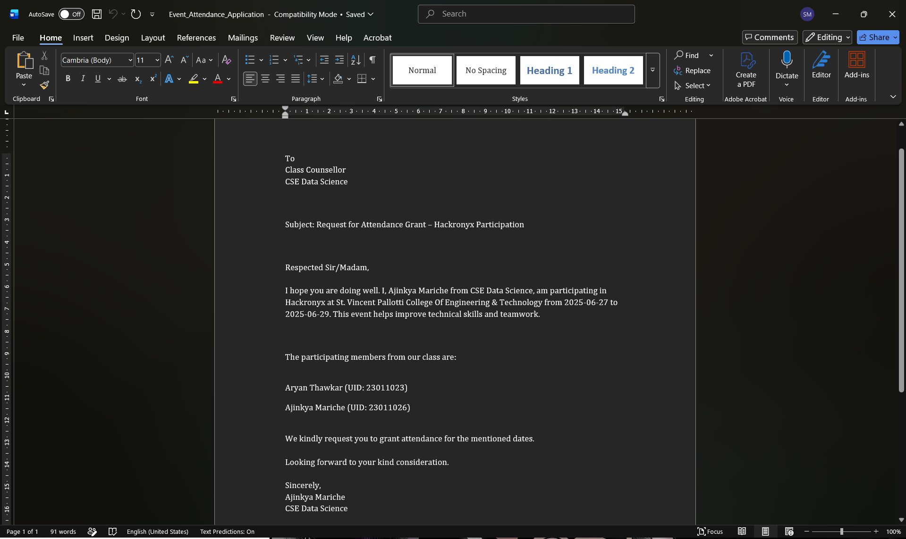

# 📄 Event Attendance Application Generator

A Flask-based web application that automates the process of generating official attendance request letters for students participating in hackathons, workshops, seminars, competitions, and other academic events.

Users can enter event details, select participating students, preview the generated application, download it as a professionally formatted Word document, and optionally send an email notification.

🌐 **Live Demo:** https://attendance-applicatiom-generator.vercel.app/

---

## ✨ Features

* 📝 Generate attendance request applications automatically
* 👥 Select multiple participating students
* 📅 Add event details including venue and dates
* 👀 Real-time application preview
* 📄 Download applications as Word documents (.docx)
* 📧 Optional email notification via EmailJS
* 🎨 Clean and responsive user interface
* ☁️ Deployed on Vercel

---

## 🛠️ Tech Stack

### Backend

* Python
* Flask

### Frontend

* HTML5
* CSS3
* JavaScript

### Document Generation

* python-docx

### Email Integration

* EmailJS

### Deployment

* Vercel

---

## 📷 Application Screenshots

### 🏠 Home Page



---

### 📝 Generated Application Preview



---

### 📧 Email Notification Preview



---

### 📄 Generated Word Document



---

## 🔄 Workflow

1. Enter event information.
2. Select participating students.
3. (Optional) Enter receiver email address.
4. Generate attendance application.
5. Preview the generated application instantly.
6. Send email notification if enabled.
7. Download the application as a Word document.

---

## 📂 Project Structure

```text
Attendance-Application-Generator/
│
├── app.py
├── requirements.txt
├── vercel.json
├── users.json
│
├── templates/
│   └── index.html
│
├── static/
│   └── app.css
│
├── Screenshots/
│   ├── home-page.png
│   ├── application-preview.png
│   ├── email-preview.png
│   └── word-document.png
│
└── README.md
```

---

## ⚙️ Installation & Setup

### Clone the Repository

```bash
git clone https://github.com/Ajinkya7890/Attendance-Application-Generator.git
```

### Navigate to Project Directory

```bash
cd Attendance-Application-Generator
```

### Install Dependencies

```bash
pip install -r requirements.txt
```

### Run the Application

```bash
python app.py
```

The application will be available at:

```text
http://127.0.0.1:5000/
```

---

## 📧 EmailJS Configuration

This project uses EmailJS for sending email notifications.

To configure your own EmailJS account:

1. Create an EmailJS account.
2. Create a new Email Service.
3. Create an Email Template.
4. Replace:

   * Service ID
   * Template ID
   * Public Key

inside:

```text
templates/index.html
```

---

## 🎯 Use Cases

* Hackathon Participation Requests
* Workshop Attendance Applications
* Seminar Participation Requests
* Competition Attendance Letters
* Academic Event Permission Applications

---

## 🚀 Future Improvements

* PDF export support
* Student database integration
* Admin dashboard
* Event history tracking
* Authentication system
* Cloud database support

---

## 👨‍💻 Authors

### Ajinkya Mariche

GitHub: https://github.com/Ajinkya7890

### Aryan Thawkar

---

## 🤝 Contributing

Contributions are welcome!

1. Fork the repository
2. Create your feature branch
3. Commit your changes
4. Push to the branch
5. Open a Pull Request

---

## 📜 License

This project is licensed under the MIT License.

---

⭐ If you found this project useful, consider giving it a star on GitHub!
